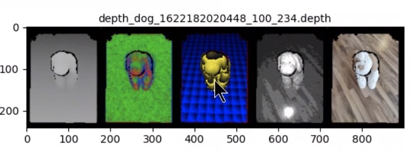

# Depthmap toolkit

Depthmap toolkit is an utility to convert and visualise the data captured by cgm-scanner.

## Overview

CGM-Scanner currently captures the data as depthmaps and PCD files. PCD file is a standardised format. Depthmap is our own format developed for high compressed data.

In the future we plan to not support PCD files anymore (due to their big size).

## Tools

### Converting PCD data into depthmap

* The convertor uses `camera_calibration.txt` file which is the calibration from Lenovo Phab 2 Pro. Converting could be done by following command:

`python convertpcd2depth.py pcd_dir calibration_file`

* The `pcd_dir` folder could contain more PCD files.
* The output will be stored in folder output.
* `calibration_file` is the txt file with calibration for the device

### Converting depthmaps into PCD data

* The convertor accepts only the data captured by cgm-scanner. The data could be captured by any ARCore device supporting ToF sensor. Converting could be done by following command:

`python convertdepth2pcd.py depthmap_dir calibration_file`

* The `depthmap_dir` folder has to contain subfolder depth containing one or more depthmap files.
* The output will be stored in folder export.
* `calibration_file` is the txt file with calibration for the device

### Visualisation of depthmaps

* The tool accepts only the data captured by cgm-scanner. The data could be captured by any ARCore/AREngine device supporting ToF sensor. Tool could be opened by following command:

`python toolkit.py depthmap_dir calibration_file `

* The `depthmap_dir` folder has to contain subfolder depth containing one or more depthmap files.
* By arrows "<<" and ">>" you can switch to next or previous depthmap in the folder
* Export OBJ will export the data as a pointcloud into OBJ file in export folder, this data will be reoriented using depthmap pose (if available)
* Export PCDwill export the data as a pointcloud into PCD file in export folder
* `calibration_file` is the txt file with calibration for the device

### Visualisation types

The tool generates 5 different visualisations (from left-to-right order):
* Depth image - this is a most raw visualisation of depthmap
* World-oriented normals - green value indicates a horizontal surface, blue and red a vertical surface (supported from scan type v1.0)
* Metrical segmentation visualisation - repeating pattern mapped on surfaces based on world-oriented normals, the pattern repeats every 10 centimeters (this might help ML models to calibrate measures captured by different devices, supported from scan type v1.0), blue is the detected floor, yellow is the detected child/object
* Confidence map - amount of IR light reflected into ToF receiver, this information might vary a lot (every sensor uses a different amount of IR light) and it is not recommended to use it for ML training
* RGB photo - captured photo (if available)
